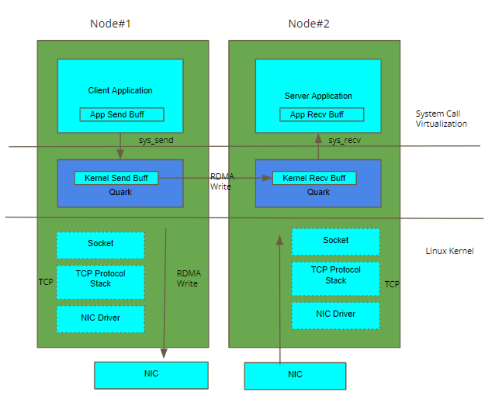

# Quark Container
Welcome to Quark Container.

This repository is the home of Quark Containers code.

## What's Quark Container

Quark Container is high performance secure container runtime with following features: 
1. OCI compatible: Quark Container includes an Open Container Initiative (OCI) interface. Common Docker container image can run in Quark Container.
2. Secure: It provides Virtual Machine level workload isolation and security.
3. High Performance: Quark Container is born for container workload execution with high performance. It is developed with the Rust programming language. 


## Performance test 

The performance slices is [performance.pdf](doc/performance.pdf). The detail test steps and result is [here](doc/perf_test.md)

## Architecture

Quark Container takes classic Linux Virtual Machine architecture as below. It includes an HyperVisor named QVisor and a guest kernel named QKernel. Unlike the common Linux Virtual Machine design, in which standard OS image such as Linux/Windows can run on Qumu. QVisor and QKernel are tightly coupled. QVisor only supports QKernel.


Quark Container's high level design is as below. It handles Container Application request with following steps.
 1. Container Application System Call: In Quark Container, Container Application run as a Guest Application. And it sends request to Quark through Guest System Call, e.g. X86-64 SysCall/SysRet.  
 2. Host System Call: From Host OS perspective, Quark is running as a common Linux application. When Quark gets Guest System Call, it will explained that in the Quark runtime. If it needs to access the host system, e.g. read host file, it will call Host OS through Host System Call.
 3. QCall: For the communication between Guest Space and Host Space, QKernel doesn't call QVisor through HyperCall directly as common Virtual Machine design. Instead, it sends request to QVisor through QCall, which is based on Share memory queue. There is a dedicated QCall handing thread waiting in Host Space to process QCall request. Based on that, VCPU thread's high cost Guest/Host switch is avoid. For the host IO data operation, such as socket read/write, Qkernel will call the Host Kernel direclty with IO-Uring, which could bypass QVisor to achieve better performance. (Note: IO-Uring won't handle IO control operation, such as Open, for security purpose)


## TCP Socket over RDMA (TSoR)
Quark Container supports to transfer the container application's TCP traffic with RDMA connection, i.e. TSoR. TSoR is a container network provider in K8S cluster and the existing TCP based container application can transfer data through RDMA without any MODIFICATION. As TSoR offline the TCP/IP protocol stack workload to RDMA NIC. It can achieve higher throughput, low latency. The [TSOR test result](doc/RDMA Benchmark (version 1).xlsx) is the tesult result of Redis benchmark with comparison between Quark + TSoR and RunC + Flannel. TSoR shows 5 timese throughput improvement over Flannel. The TSoR architecture is as below. The introduction is here (doc/TCP Socket over RDMA.pptx)



## System Requirement
1. OS: Linux Kernel > 5.8.0
2. Processor: X86-64 (Quark only support 64 bit architecture, So far only support Intel CPU)
3. Docker: > 17.09.0
4. Enable virtualization technology in BIOS (Usually in Security tab of BIOS)

## Installing from source

### Requirement 
Quark builds on X86-64 only. Other architecture will be available in the future.

Quark is developed with Rust language. The build needs to install Rust nightly. Please use current known good version "nightly-2021-12-04-x86_64-unknown-linux-gnu"

```sh
rustup toolchain install nightly-2021-12-04-x86_64-unknown-linux-gnu
rustup default nightly-2021-12-04-x86_64-unknown-linux-gnu

```

After installing both Rust and Rust nightly. Please also install "cargo-xbuild" as below.
```sh
cargo install cargo-xbuild
```
And Installing lcap library
```sh
sudo apt-get install libcap-dev
```
Also, some extra libraries for compiling RDMA module:
```sh
sudo apt-get install build-essential cmake gcc libudev-dev libnl-3-dev libnl-route-3-dev ninja-build pkg-config valgrind python3-dev cython3 python3-docutils pandoc libclang-dev
```
And also add the rust-src component to the current toolchain:
```sh
rustup component add rust-src
```

### Build
```sh
git clone git@github.com:QuarkContainer/Quark.git
cd Quark
make
make install
```

### Install / Setup / Configuration
1. Install binary: Quark has 2 binaries: "quark" and "qkernel.bin". Both of them was copied to /usr/local/bin/ folder when running `make install`. "quark" contains QVisor code and it also implement the OCI interface.
2. Setup Docker: To enable Docker to run container with Quark Container, "/etc/docker/daemon.json" needs to be updated. Example is as [daemon.json](doc/daemon.json)
3. Create log folder
```sh
sudo mkdir /var/log/quark
```
5. Restart Docker: After the "/etc/docker/daemon.json" is updated, The Docker daemon restart is need to enable the configuration change
```sh
sudo systemctl restart docker
```

### Helloworld: 

The helloworld docker sample application can be executed as below:
```sh
sudo systemctl restart docker
docker run --rm --runtime=quark hello-world
```      
    
## Configuration
Quark Container's configuration file is at [/etc/quark/config.json](config.json). Configuration detail is TBD...

## Debug and Log
Quark Container's debug log is put in /var/log/quark/quark.log. It could enable or disable by "DebugLevel" of [/etc/quark/config.json](config.json). There are 5 possible value of "DebugLevel" as below.

    Off,
    Error,
    Warn,
    Info,
    Debug,
    Trace,
    
When log is enabled, e.g. Debug. After run a docker image with Quark Container, the logs will be generated in the /var/log/quark/quark.log.
doc

## k8s set up and use TCP over RDMA
Please refer to [this link](doc/k8s_setup.md) to set up k8s using quark container and RDMA support.

## Communications
Slack: https://join.slack.com/t/quarksoftgroup/shared_invite/zt-oj7dgqet-6iUXmOnMbqHj4g_XAd_3Mg
